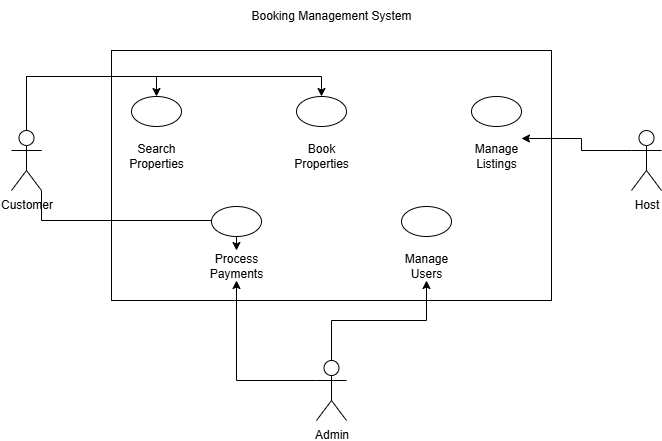

# Requirement Analysis in Software Development

This repository is dedicated to documenting the **requirement analysis** phase of a booking management system project.  

The purpose is to practice and master how requirements are gathered, structured, and documented in the **Software Development Life Cycle (SDLC)**.  
It will cover:  
- Identifying functional and non-functional requirements  
- Creating visual diagrams (use case, actors, etc.)  
- Defining acceptance criteria  
- Following industry-standard practices for requirement analysis

## What is Requirement Analysis?

Requirement Analysis is the process of **gathering, understanding, and documenting** the needs and expectations of stakeholders for a software system.  
It serves as the foundation of the **Software Development Life Cycle (SDLC)** because it clearly defines *what* needs to be built before actual development begins.

Key points about Requirement Analysis:
- **Clarifies scope:** Prevents misunderstandings by ensuring all stakeholders agree on the goals.  
- **Guides development:** Provides developers, designers, and testers with a structured roadmap.  
- **Saves time and cost:** Detecting issues in the requirement phase is far cheaper than fixing them later.  
- **Improves quality:** Leads to systems that better meet user needs and business objectives.  

In short, requirement analysis is critical because it ensures that the final system is both **useful** (solves the right problem) and **usable** (works effectively for end users).

## Why is Requirement Analysis Important?

Requirement Analysis is a **cornerstone of the Software Development Life Cycle (SDLC)** because it directly impacts the success or failure of a project. Some key reasons include:

1. **Prevents Miscommunication**  
   Clearly documenting requirements ensures that all stakeholders, developers, designers, testers, and clients share the same understanding of the system’s goals.

2. **Reduces Costs and Delays**  
   Identifying problems or unclear requirements early is far less expensive than fixing them later in the development or deployment stages.

3. **Ensures User Satisfaction**  
   By focusing on actual business needs and user expectations, requirement analysis increases the likelihood that the final product will solve the right problem and provide real value.

4. **Provides a Roadmap for Development**  
   Well-defined requirements act as a guide for the team, reducing confusion and keeping the project aligned with its objectives.

## Key Activities in Requirement Analysis

Requirement Analysis involves several structured activities that ensure project requirements are captured, understood, and validated properly:

- **Requirement Gathering**  
  Collecting initial inputs from stakeholders, clients, and users to identify high-level needs.

- **Requirement Elicitation**  
  Using techniques such as interviews, surveys, workshops, and observation to uncover detailed requirements.

- **Requirement Documentation**  
  Organizing and recording requirements clearly in documents, diagrams, or models for easy reference by the team.

- **Requirement Analysis and Modeling**  
  Examining the requirements for feasibility, consistency, and completeness, often representing them visually through use cases, flowcharts, or diagrams.

- **Requirement Validation**  
  Confirming with stakeholders that the documented requirements accurately reflect their needs and expectations. 

## Types of Requirements

In software projects, requirements are broadly categorized into **Functional** and **Non-functional**.  

| **Type**                 | **Definition**                                                                 | **Examples for Booking Management System**                                                                 |
|---------------------------|---------------------------------------------------------------------------------|-------------------------------------------------------------------------------------------------------------|
| **Functional Requirements** | Describe what the system should do, the features and behaviors it must support. | 1. Users can create accounts and log in. 2. Customers can search for available properties by date and location. 3. Booking a property and receiving confirmation. 4. Hosts can list, edit, and delete their properties. |
| **Non-functional Requirements** | Describe how the system performs its functions, focusing on quality attributes. | 1. The system should handle at least 500 concurrent users. 2. Page load time must be under 2 seconds. 3. Data must be encrypted to ensure security. 4. The system should be available 99.9% of the time. |

## Use Case Diagrams

Use Case Diagrams are a visual way of capturing the interactions between **actors** (such as users or external systems) and the **system** being developed.  

### Benefits of Use Case Diagrams
- Provide a clear, high-level view of system functionality.  
- Help identify all possible interactions between users and the system.  
- Useful for communication between stakeholders and developers.  

### Booking Management System – Use Case Diagram
The diagram below shows the main actors and their interactions with the system:  

- **Actors**: Customer, Host, Admin  
- **Use Cases**: Search properties, Book property, Manage listings, Process payments, Manage users  

## Acceptance Criteria

Acceptance Criteria are the conditions that a software product must meet in order to be accepted by the stakeholders (such as clients, users, or product owners). They define the boundaries of a user story or feature and ensure that all parties have a common understanding of when a feature is considered "done."

### Importance of Acceptance Criteria
- **Clarity**: They remove ambiguity by clearly stating what needs to be achieved.  
- **Alignment**: Ensure that developers, testers, and stakeholders share the same expectations.  
- **Testability**: Provide a basis for writing test cases to validate functionality.  
- **Quality Assurance**: Help confirm that the delivered feature meets business and user needs.  

### Example: Checkout Feature
**User Story**: As a customer, I want to complete a booking and pay securely so that I can confirm my reservation.  

**Acceptance Criteria**:  
- The system must allow the customer to view a summary of the booking before payment.  
- The payment process must support valid credit/debit cards and secure payment gateways.  
- On successful payment, the system must generate a booking confirmation and send it via email.  
- If payment fails, the system must show an error message and allow retry.  
- All transactions must be logged for audit purposes.  